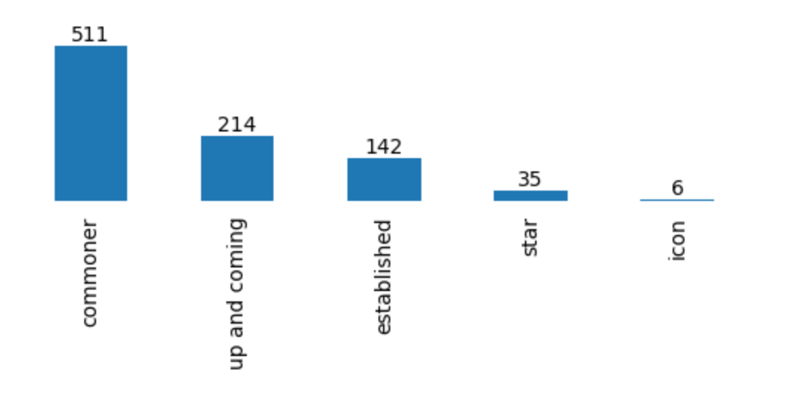
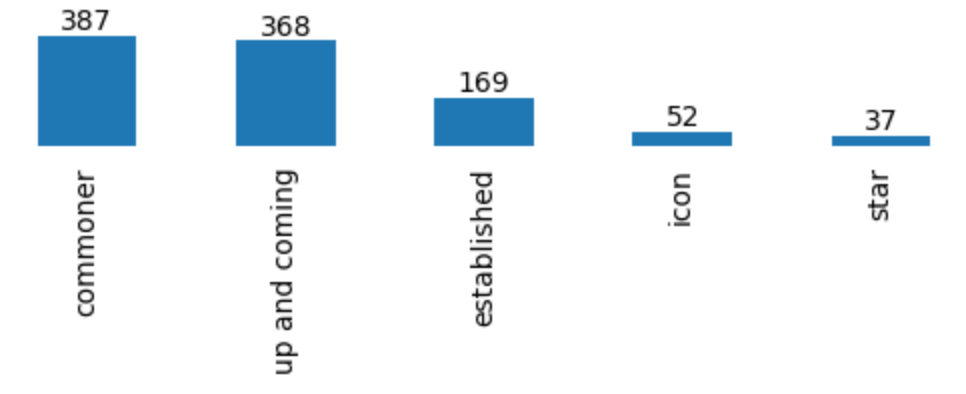

# Interep Groups Exploratory Data Analysis

## Data

Public user profiles on the Interep supported provider platforms (currently GitHub, Reddit, Twitter)

- twitter, reddit, github: manual collecting of data via public APIs

## Objectives

1. Collect a data sample of reasonable size: between 100-1000 public user profiles for each provider
2. Evaluate the current shape of the reputation distribution for each provider/
3. Define appropriate level thresholds so that the distribution is skewed from `undefined` to `gold`
   Indeed common sense tells that there should be a lot of `undefined` or `bronze`, some `silver` but just a few `gold`.

## Getting started

### Twitter scripts
1. Define your config settings in `.config.yaml`  
   For twitter you'll need to get a bearer token from https://developer.twitter.com/en
2. `npm add -g pnpm`
3. `pnpm i`
4. `nps "start <sample-size>"`
5. Sample is stored in `data/twitter.json`
6. Normalize json: `python normalize.py twitter`
7. Create visualization: `nps viz.twitter`

### GitHub scripts
Direct connection to a bigquery data in jupyter notebook.
Node script similar to Twitter's for other GitHub stats.

## Collected Samples

| Provider |                     File(s)                     |                                Size                                | Result(s)                                                                                              |
|:--------:|:-----------------------------------------------:|:------------------------------------------------------------------:|--------------------------------------------------------------------------------------------------------|
|  GitHub  | [gh-user-stats.json](./data/gh-user-stats.json) | 1.7M users for received stars, 1000 users profiles for other stats | See [gh-stars.ipynb](notebooks/gh-stars.ipynb), [gh-other-stats.ipynb](notebooks/gh-other-stats.ipynb) |
|  Reddit  |        [reddit.json](./data/reddit.json)        |                                1013                                | See [reddit.ipynb](notebooks/reddit.ipynb)                                                             |
| Twitter  |       [twitter.json](./data/twitter.json)       |                                908                                 | See [twitter.ipynb](notebooks/twitter.ipynb)                                                           |

## Reputation
Specific reputation algorithms for each provider were defined empirically based on data analysis.  
Tiers names are: commoner, up-and-coming, established, star and icon.

### Twitter

|followers|< 100|< 1k|< 10k|< 100k|>= 100k|
|:-----------------:|:--:|:---:|:----:|:----:|:-----:|
|is likely bot (botometer `cap` >= 0.95)|commoner|commoner|commoner|commoner|commoner|
|is likely not bot (botometer `cap` < 0.95) & not verified|commoner|up-and-coming|established|star|icon|
|is likely not bot (botometer `cap` < 0.95) & not verified|commoner|up-and-coming|established|star|icon|
|is likely not bot (botometer `cap` < 0.95) & verified|established|established|established|star|icon|

#### Tiers distribution simulation results

### Reddit

|total karma|< 2k|< 20k|< 100k|< 200k|>= 200k|
|:-----------------:|:--:|:---:|:----:|:----:|:-----:|
|is gold|up-and-coming|up-and-coming|established|star|icon|
|is not gold|commoner|up-and-coming|established|star|icon|

#### Tiers distribution simulation results

### GitHub
TODO