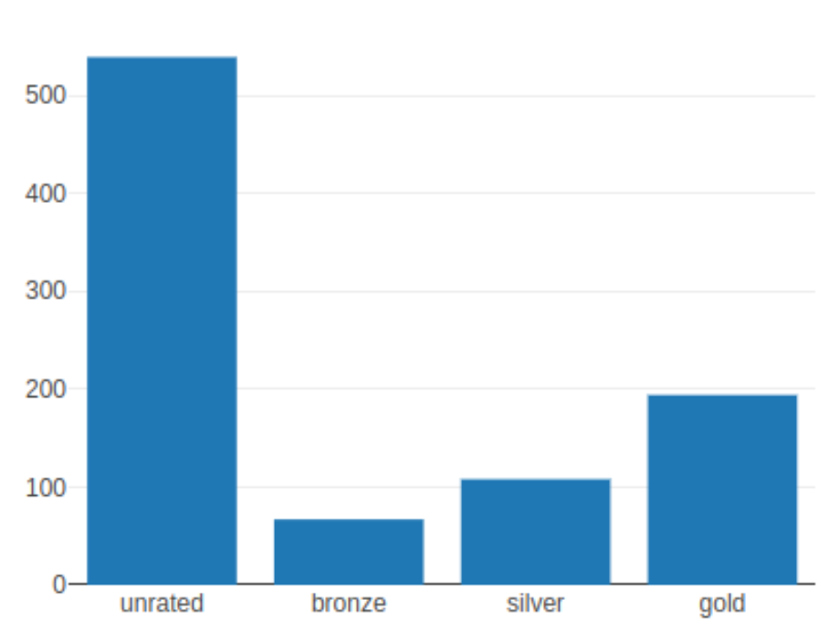

# Interep Groups Exploratory Data Analysis

## Data

Public user profiles on the Interep supported provider platforms (currently GitHub, Reddit, Twitter)

- twitter: manual collecting of data
- reddit: check https://files.pushshift.io/reddit ?
- github: check https://towardsdatascience.com/i-scraped-more-than-1k-top-machine-learning-github-profiles-and-this-is-what-i-found-1ab4fb0c0474 ?

## Objectives

1. Collect a data sample of reasonable size: between 100-1000 public user profiles for each provider
2. Evaluate the current shape of the reputation distribution for each provider/
3. Define appropriate level thresholds so that the distribution is skewed from `undefined` to `gold`
   Indeed common sense tells that there should be a lot of `undefined` or `bronze`, some `silver` but just a few `gold`.

## Getting started

1. Define your config settings in `.config.yaml`  
   For twitter you'll need to get a bearer token from https://developer.twitter.com/en
2. `npm add -g pnpm`
3. `pnpm i`
4. `nps "start <sample-size>"`
5. Sample is stored in `data/twitter.json`

## Collected Samples

| Provider |              File              | Size | Result                               |
|:--------:|:------------------------------:|:----:|--------------------------------------|
|  GitHub  |        :calendar: TODO         |      |                                      |
|  Reddit  |        :calendar: TODO         |      |                                      |
| Twitter  | [twitter](./data/twitter.json) | 552  |  |
